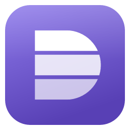

<p align="center"></p>
<h1 align="center">Dockering</h1>
<p align="center"><b>A fast, native desktop client for container engines.</b><br>
Docker · Docker inside WSL distros · WSL containers (WSLC). One lightweight window, on Windows, macOS, and Linux.</p>
<p align="center">
  <a href="https://github.com/pavel-purma/dockering/actions/workflows/ci.yml"></a>
  <a href="https://github.com/pavel-purma/dockering/actions/workflows/release.yml"></a>
  <a href="#license"></a>
  <a href="https://github.com/pavel-purma/dockering/releases/latest"></a>
  <a href="https://github.com/pavel-purma/dockering/releases"></a>
  <!-- winget is deferred until the first signed submission:
  <a href="https://winstall.app/apps/PavelPurma.Dockering"></a>
  -->
</p>

<!-- TODO: add docs/assets/screenshot-containers.png (the containers list grouped by Compose project) -->

## Download

**[Dockering 0.1.0](https://github.com/pavel-purma/dockering/releases/tag/v0.1.0)** is available
for Windows, macOS, and Linux on x64 and ARM64. Downloads are unsigned.

| Windows | macOS | Linux |
|---|---|---|
| [Installer (x64)](https://github.com/pavel-purma/dockering/releases/latest/download/Dockering-Setup-x64.exe) · [ARM64](https://github.com/pavel-purma/dockering/releases/latest/download/Dockering-Setup-arm64.exe) | [Apple silicon](https://github.com/pavel-purma/dockering/releases/latest/download/Dockering-aarch64.dmg) · [Intel](https://github.com/pavel-purma/dockering/releases/latest/download/Dockering-x86_64.dmg) | [AppImage](https://github.com/pavel-purma/dockering/releases/latest/download/Dockering-x86_64.AppImage) · [.deb](https://github.com/pavel-purma/dockering/releases/latest/download/Dockering-x86_64.deb) · [.tar.gz](https://github.com/pavel-purma/dockering/releases/latest/download/Dockering-x86_64.tar.gz) |
| winget: planned after signing | | ARM64: [AppImage](https://github.com/pavel-purma/dockering/releases/latest/download/Dockering-aarch64.AppImage) · [.deb](https://github.com/pavel-purma/dockering/releases/latest/download/Dockering-aarch64.deb) · [.tar.gz](https://github.com/pavel-purma/dockering/releases/latest/download/Dockering-aarch64.tar.gz) |
| Portable: [x64 zip](https://github.com/pavel-purma/dockering/releases/latest/download/Dockering-x64.zip) · [ARM64 zip](https://github.com/pavel-purma/dockering/releases/latest/download/Dockering-arm64.zip) | | |

Check downloads against [SHA256SUMS](https://github.com/pavel-purma/dockering/releases/download/v0.1.0/SHA256SUMS).
See [all releases](https://github.com/pavel-purma/dockering/releases) and the
[verification record](docs/plan/release-checklist.md#evidence-for-v010).
Public GitHub release builds generate build-provenance attestations: `gh attestation verify <file> -R pavel-purma/dockering`.

> The first release uses unsigned downloads. Windows may show SmartScreen prompts; macOS builds
> are not notarized and may require approval in Privacy & Security. See [installation details](docs/release.md#unsigned-installation).
> Automatic updates and winget are deferred until a signed release.

### Install on Windows

- **Installer:** run `Dockering-Setup-x64.exe`. By default it installs for your user only, into
  `%LocalAppData%\Programs\Dockering`, and needs no admin rights. To install for all users, pick that
  option in the wizard or pass `/ALLUSERS`. For a silent install, run
  `Dockering-Setup-x64.exe /VERYSILENT /SUPPRESSMSGBOXES /NORESTART`.
- **winget (planned):** available after the first signed release. Use the installer or portable zip for now.
- **Portable:** unzip `Dockering-x64.zip` anywhere and run `dockering.exe`. The portable build
  uses manual downloads for updates in the unsigned release.

Requires Windows 10 22H2 or newer, x64 or ARM64.

## Why Dockering

- **Native and fast.** Built with Rust and GPUI, GPU-rendered at 60 fps. No Electron.
- **All your engines in one place.** Docker Desktop, Docker inside any WSL distro, WSL containers,
  and remote Docker over TLS. Switch between them with `Ctrl+K`.
- **Shortcuts for almost everything.** Every action is in the command palette (`Ctrl+Shift+P`).
- **Just the core.** Containers grouped by Compose project, logs, an interactive terminal, live
  stats, images, volumes, and networks. No sign-in, no extensions, no telemetry.

## Features (v1)

- Containers: flat list or grouped by Compose project, with start, stop, restart, and delete, including bulk actions
- Container detail: overview, logs, interactive terminal, live CPU/memory/network/disk charts, mounts, network, and inspect
- Images (pull, run, delete, prune), volumes (create, delete, prune), and networks
- Multiple engines with one-click switching: local socket or pipe, remote TCP/TLS, WSL distros, and WSLC

## Updates

The first unsigned release uses manual updates from the [Releases page](https://github.com/pavel-purma/dockering/releases).

Future builds with the updater enabled check GitHub Releases for a new version once a day. Installed Windows copies
download it in the background and show **Restart to update** in the status bar. Nothing is
installed until you click it. Portable, macOS, and Linux builds only tell you that a new version
is out.

## Privacy & network

Dockering talks only to the engines you configure and, through them, to registries. The one
other request, in future builds with the updater enabled, is the update check: an anonymous HTTPS
GET of the latest release manifest from `github.com`, with no ids or cookies.

You can turn the update check off three ways:

- in **Settings › Updates**;
- with the environment variable `DOCKERING_DISABLE_UPDATES=1`;
- for a whole machine, with the policy value `HKLM\Software\Policies\Dockering\DisableUpdates = 1` (DWORD).

Before anything runs, a download is checked against a signed manifest and its SHA-256 hash.

## Build from source

Rust is pinned in `rust-toolchain.toml` (rustup installs it automatically). GPUI Kit also needs
native prerequisites. See [spec 50](docs/spec/50-build-and-release.md#platform-prerequisites-from-gpui-kit).

| OS | Prerequisites | Set up |
|---|---|---|
| Windows 10 22H2+ / 11 | VS 2022+ Build Tools ("Desktop development with C++", x64 CRT, Windows SDK) | `pwsh -NoProfile scripts/bootstrap.ps1` checks them; add `-Install` to install Build Tools with winget |
| macOS 15+ | Xcode Command Line Tools | `scripts/bootstrap.sh` (or `xcode-select --install`) |
| Linux (Ubuntu 24.04 names) | `gcc g++ clang libfontconfig-dev libwayland-dev libxkbcommon-x11-dev libx11-xcb-dev libssl-dev libzstd-dev libvulkan1 mesa-vulkan-drivers`, plus a Wayland or X11 session with a Vulkan driver | `scripts/bootstrap.sh` (apt) |

On Windows, run cargo through `scripts/dev.ps1`. It loads the VS Build Tools environment
(`vcvars64.bat`) and passes its arguments to cargo. Without it, linking fails with
`msvcrt.lib` not found.

```sh
# Run the app
cargo run -p dockering                               # macOS / Linux
pwsh -NoProfile scripts/dev.ps1 run -p dockering     # Windows

# Demo mode with a built-in fake engine, no Docker needed (planned; not wired up yet)
cargo run -p dockering -- --demo

# Tests and lints (prefix with `pwsh -NoProfile scripts/dev.ps1` on Windows)
cargo nextest run --workspace                        # or: cargo test --workspace
cargo clippy --workspace --all-targets -- -D warnings
cargo fmt --all
cargo xtask check-blocking                           # NFR-001: no blocking calls on the UI thread
cargo deny check                                     # licences and advisories (cargo install cargo-deny)

# Packages (needs: cargo install cargo-packager --locked --version 0.11.8)
cargo xtask dist                                     # release build + package for the host
cargo xtask package --target <triple>                # package an existing release build
```

Packages go to `target/dist/<triple>/` with stable names (REL-012): `Dockering-Setup-<x64|arm64>.exe`
(needs Inno Setup 6.3+: `winget install JRSoftware.InnoSetup`) and `Dockering-<arch>.zip` on Windows,
`Dockering-<arch>.dmg` on macOS, and `.deb`, `.AppImage`, and `.tar.gz` on Linux.

After changing dependencies, regenerate the third-party notices with
`cargo about generate about.hbs -o THIRD_PARTY_LICENSES.html` (`cargo install cargo-about --locked --features cli`).
CI fails if the file is stale.

### VS Code

`.vscode/` has ready-made tasks and debug configurations (they go through `scripts/dev.ps1` on
Windows, so the MSVC environment is loaded automatically):

- **Run:** *Terminal → Run Task…* → `run: Dockering`, `run: Dockering (demo)`, or `run: Dockering (release)`.
- **Debug:** *Run and Debug* (F5) → `Debug Dockering`, `Debug Dockering (demo)`, `Debug Dockering (release)`
  (release optimisations with symbols, profile `release-debug`), or `Debug dk-hub dump example`.
  Windows uses the C/C++ extension's debugger (`cppvsdbg`); macOS/Linux use CodeLLDB.
- **Checks:** `test: workspace` (default test task), `check: clippy`, `check: blocking calls (NFR-001)`.

### Zed

`.zed/tasks.json` and `.zed/debug.json` mirror the VS Code setup (Windows commands go through
`scripts/dev.ps1` via `pwsh -File`):

- **Run:** command palette → `task: spawn` (`alt-shift-t`) → `run: Dockering`, `run: Dockering (demo)`,
  `run: Dockering (release)`; also `build: …`, `test: workspace`, `check: clippy`, `check: blocking calls (NFR-001)`.
- **Debug:** `debugger: start` (`F4`) → `Debug Dockering`, `Debug Dockering (demo)`, `Debug Dockering (release)`,
  `Debug dk-hub dump example`. Uses Zed's built-in CodeLLDB adapter; each scenario builds first.
  On Windows (MSVC/PDB) breakpoints, stepping and backtraces work, but LLDB can't inspect Rust locals
  in detail — use the VS Code `cppvsdbg` configuration when you need that. On macOS/Linux, drop the
  `.exe` suffix from `program` in `.zed/debug.json`.

## Releases

The first release used the manual-tag flow: the release workflow built all six targets and
created a draft GitHub Release, which was verified and published under maintainer approval.
[release-plz](https://release-plz.dev) automation can create release PRs and version tags after
the release-bot App is configured. The first release is unsigned; signing is optional
configuration for later releases. [docs/release.md](docs/release.md) has the details,
including the publication checklist and future signing setup. PR titles use
[conventional commits](https://www.conventionalcommits.org/), because they become the changelog.

## License

Licensed under the [MIT License](LICENSE).
Third-party notices: [THIRD_PARTY_LICENSES.html](THIRD_PARTY_LICENSES.html).

## Contributing with agents

This repository uses a spec-driven agentic workflow with **Claude Code and OpenCode**.
Start with the shared [AGENTS.md](AGENTS.md) and the [specification](docs/spec/README.md).
Both tools use the same skills and specialist agent prompts. Plan features with
`/feature-planning <idea>`. See [the agent setup guide](docs/agent-setup.md) for usage,
configuration, and maintenance.
