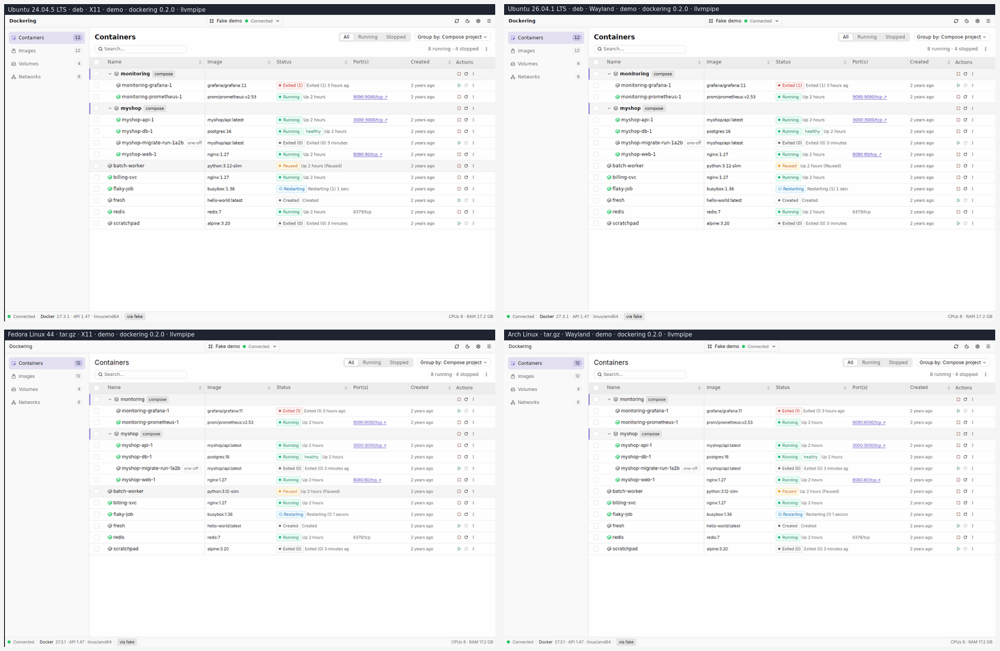

# Plan: Linux install-and-launch smoke test (Ubuntu, Fedora, Arch)

- **Slug:** `linux-install-smoke-test`
- **Status:** in progress: built and green on GitHub in draft PR #37 (a pull-request run and a manual dispatch, 2026-10-10); the merge, then the first release and weekly runs, are pending (approved 2026-10-08, built 2026-10-09)
- **Spec:** [Distribution §8](../../spec/features/distribution.md#8-linux-install-and-launch-smoke-test-rel-070077)
- **Milestone:** after v0.2.0
- **Requirement IDs:** REL-070…077 (new)
- **Created:** 2026-10-08

## 1. Goal

After a release is published, and once a week, GitHub Actions installs the published Linux packages into
clean Ubuntu, Fedora and Arch containers, starts Dockering on a headless display, drives it with the
keyboard, takes screenshots, each captioned with the platform it came from, and quits it. A failed install,
launch, page switch, quit or upgrade fails the run and keeps the evidence.

No CI step starts the app today (release checklist, *Open items*). The first 0.2.0 build crashed on every
launch and passed every check. The test fails that build and passes the republished one (§6.5, §8).



## 2. Scope

**In:** a workflow and scripts that test the published `x86_64` packages (`.deb`, `.tar.gz`, `.AppImage`) on four
legs: Ubuntu 24.04, Ubuntu 26.04, Fedora (latest), Arch Linux; X11 and Wayland; screenshots and a keyboard walk
through the pages; a launch on a profile written by an older version; evidence and a drift alert.

**Out:** GPU rendering (hosted runners have no GPU; Mesa's software Vulkan driver is used); native `.rpm` or Arch
packages (none are shipped, see question 1); Docker engine scenarios and aarch64 (phase 2); Windows and macOS
launch checks; changing the app (the findings in §6.5 are follow-ups). The in-process view tests
(`gpui::TestAppContext` + `FakeEngine`) stay the place for UI logic: this test runs the *shipped* binary on real
distributions with a real display server.

## 3. Assumptions & open questions

| # | Assumption / question | Default if unanswered |
|---|---|---|
| 1 | **Fedora and Arch have no native package.** The release ships `.deb`, `.AppImage` and `.tar.gz` only. cargo-packager 0.11.8 has no `.rpm` format, and its `pacman` format is a tar.gz plus a PKGBUILD. "Regular package installation" therefore means a real `apt install` of the `.deb` on Ubuntu, and the `.tar.gz` plus its runtime libraries on Fedora and Arch. Every leg also runs the AppImage. Do you want a `.rpm` and a PKGBUILD shipped, so those legs use `dnf` and `pacman`? | No: a separate packaging feature. The matrix has a `package` field to take it later. |
| 2 | Test after publication only, or also the draft before the maintainer publishes? | After publication (the request: the current release). A draft gate is task 7. |
| 3 | Fail on the `.deb`'s missing glibc floor right away? The published `.deb` fails it (finding F1). | Warn (`INFO`) until packaging declares the floor, then fail (task 5). |
| 4 | x86_64 only? | Yes. aarch64 is task 8: Ubuntu and Fedora on `ubuntu-24.04-arm`; Arch has no official arm64 image. |
| 5 | Software rendering is enough. | Yes. GPU-driver bugs stay on the manual release checklist. |
| 6 | Images avoid Docker Hub, which limits anonymous pulls to 100 per 6 hours per IP and gives hosted runners no exemption. | `mirror.gcr.io/library/ubuntu` (same digests as Docker Hub's official images at the time of the spike), `quay.io/fedora/fedora`, `ghcr.io/archlinux/archlinux`. |

## 4. Requirements (as written into the spec)

| ID | Requirement | New/Changed |
|---|---|---|
| REL-070 | `linux-smoke.yml` installs the published Linux x86_64 packages into clean Ubuntu 24.04, Ubuntu 26.04, Fedora and Arch containers and starts the app. Triggers: release published, weekly, manual dispatch, pull requests touching it. Independent legs; any failed leg fails the run. | New |
| REL-071 | The tested bytes are the published ones: checksums (exactly three `SHA256SUMS` entries) and `gh attestation verify` pinned to `release.yml`, the tag ref and no self-hosted runners, before anything is installed. | New |
| REL-072 | Install like a user: the `.deb` through apt with declared dependencies only; Fedora and Arch from the `.tar.gz` with named runtime libraries; every leg also runs the AppImage. `--version`, `ldd`, licence files, desktop entry and icon are checked. | New |
| REL-073 | The `.deb`'s `libc6` dependency carries a version at least as high as the highest `GLIBC_x.y` the binary needs. Warning first, failure once packaging declares it. | New |
| REL-074 | Launch the demo profile on Xvfb and on headless sway; the window appears, paints and settles; the five navigation chords select their pages (read through AT-SPI); every sidebar item can be activated through the accessibility API; the app quits with status 0 and saves `last_run_version`. | New |
| REL-075 | A launch on a profile from an older version succeeds; no crash file, no panic, no unexpected WARN or ERROR. | New |
| REL-076 | Screenshots, logs, results and a contact sheet are kept as artifacts; counts and the image digest go to the job summary. | New |
| REL-077 | Registry mirrors instead of Docker Hub; Fedora and Arch on `latest` on purpose; a failed scheduled run opens or updates one issue. | New |

## 5. Engine contract impact

None. Engine APIs, capabilities, hub threading, application UI and keyboard bindings do not change.

## 6. Design

### 6.1 Flow

```
release published ─┐   fetch (ubuntu-24.04, contents: read, attestations: read)
weekly schedule ───┼─> resolve tag ─> gh release download (3 packages + SHA256SUMS) ─> sha256sum -c
manual dispatch ───┤   ─> gh attestation verify x3 ─> artifact "packages"
pull request ──────┘                                │
                                                    v
        smoke x4 (matrix, fail-fast off, hosted ubuntu-24.04 runner; leg.sh = `docker run <distro image>`)
          entry.sh deb|tar : install the package, add the headless tools
          run.sh x4        : demo on X11 · demo on Wayland · upgrade profile · AppImage
          -> out/ (results.txt, captioned screenshots, logs, contact sheet) -> artifacts + job summary
        selftest (pull requests and manual runs only): breaks the harness's inputs and demands the named failures
        alert (schedule only, on failure): open or comment on one issue
```

Why `docker run` from the runner instead of a job-level `container:`: only the test runs inside the distro image,
with read-only package and script mounts and none of the job's environment, token or secrets, and the same
command runs on a developer machine (`leg.sh` is that command; `docs/release.md` shows how).

Trigger behaviour that shapes the plan: a `release` event runs at the tag's commit (observed: the `winget` run
started by publishing v0.2.0 had head SHA `2d25f6c`, the tag's commit), so it uses the workflow file and scripts from
that commit. The first automatic run is therefore the release cut after this merges; v0.2.0 itself is covered by a
manual dispatch with `tag=v0.2.0` and by the weekly run. Dispatch and schedule use the files on `main`.

### 6.2 What a leg checks

| Check | Meaning |
|---|---|
| `version` | `dockering --version` prints `dockering <tag version>` |
| `libraries`, `install_files`, `desktop_entry` | `.deb` and tar: `ldd` resolves everything; licence files, desktop entry and 512 px icon exist; `desktop-file-validate` passes |
| `libc_floor` | `.deb`: the declared `libc6 (>= N)` is at least the highest `GLIBC_` the binary needs |
| `window`, `window_identity` | a window appears within 40 s; `WM_CLASS` / `app_id` is `dev.dockering.Dockering` |
| `first_paint`, `first_frame_stable`, `alive` | more than 200 colours on screen, then two frames 1 s apart differ by under 500 px |
| `atspi_tree`, `keys_*`, `click_*`, `page_*` | the accessibility tree is reachable; `Mod+2`, `Mod+3`, `Mod+4`, `Mod+,`, `Mod+1` select Images, Volumes, Networks, Settings, Containers; each sidebar item can be activated through the accessibility API; each page shows its named controls |
| `clean_quit` | exit status 0 within 10 s (X11: palette *Quit Dockering*; Wayland: the compositor's close request) |
| `state_saved` | `state.json` holds `last_run_version` equal to the tag's version |
| `no_crash`, `log_clean` | no crash file, no panic; no WARN or ERROR beyond a short allowlist of headless noise, each entry with its cause |

Scenarios: `demo` on X11 and on Wayland (`--demo`: a populated in-memory engine, no container engine needed);
`upgrade` (a profile that says 0.0.1 ran last, real mode, no engine in the container, so the first-run screen
and the "Updated to" notice show); the AppImage on X11. The final local run of the implemented scripts passed 24, 24,
13 and 21 checks per leg and scenario on all four legs, and failed none.

Every PNG a scenario saves carries a one-line caption strip naming its origin, for example `Fedora Linux 44 · tar.gz ·
Wayland · demo · dockering 0.2.0 · llvmpipe`, so a single screenshot says which platform it came from. Captions are
added when the scenario exits, so the checks see the raw frames, and a frame that cannot be captioned stays as taken (an
INFO line `captions` counts both).

### 6.3 Display, input and screenshots

| | X11 | Wayland |
|---|---|---|
| Display server | Xvfb 1280x800, no window manager | headless sway (wlroots headless backend, pixman) |
| Input | `xdotool` | `wtype`, with a 600 ms lead-in inside the same process |
| Screenshot | ImageMagick `import -window root` | `grim` |
| Quit | palette *Quit Dockering* | compositor close request |

Rendering is Mesa's software Vulkan driver (`mesa-vulkan-drivers`, or `vulkan-swrast` on Arch). GPUI picks the CPU
adapter (`llvmpipe`) by itself. The `.deb` does not depend on a Vulkan driver, so the harness adds one the way a
desktop's GPU stack would. Content is checked through the accessibility tree: `dbus-run-session`, `at-spi-bus-launcher`
and `org.a11y.Status IsEnabled`, read with `python3-gi` (`atspi.py`). The scripts are in `scripts/linux-smoke/`:
`fetch.sh` (download and verify, on the runner), `leg.sh` (one distro container), `entry.sh` (install and harness
inside it), `run.sh` (one scenario), `atspi.py` (accessibility assertions), `selftest.sh`, `selftest-entry.sh` and
`stub-app.sh` (the self-test).

### 6.4 The matrix

| Leg | Image | Package | Installed by the leg |
|---|---|---|---|
| Ubuntu 24.04 | `mirror.gcr.io/library/ubuntu:24.04` | `.deb` | `apt-get install --no-install-recommends ./Dockering-x86_64.deb`, then `mesa-vulkan-drivers` |
| Ubuntu 26.04 | `mirror.gcr.io/library/ubuntu:26.04` | `.deb` | the same |
| Fedora (44) | `quay.io/fedora/fedora:latest` | `.tar.gz` | `vulkan-loader mesa-vulkan-drivers libwayland-client libxkbcommon libxkbcommon-x11 libX11-xcb libxcb fontconfig freetype libzstd` |
| Arch Linux | `ghcr.io/archlinux/archlinux:latest` | `.tar.gz` | `vulkan-icd-loader vulkan-swrast wayland libxkbcommon libxkbcommon-x11 libxcb libx11 fontconfig freetype2 zstd` |

### 6.5 What the spike showed

The prototype, and later the implemented scripts, ran against the published v0.2.0 packages in local Docker containers (Docker Desktop on WSL2),
four legs in parallel, about 1 min 45 s to 3 min 10 s per leg (setup 26 to 115 s). Two earlier runs spent 547 s and 845 s in setup
because of a slow apt mirror, so the job timeout is 30 minutes and package installs retry. A hosted `ubuntu-24.04`
runner of a public repository has 4 vCPU, 16 GB RAM and 14 GB of disk (GitHub's runner reference) and Docker (the
`integration-docker` job already uses it); with a container limited to 4 CPUs the Ubuntu leg took the same time
(window after 0.3 s, first paint after 0.1 to 0.2 s, 18 of 18 checks, three runs). The workflow passes
actionlint 1.7.12 with its embedded shellcheck, and has since run on GitHub (next paragraph).

**On GitHub.** The pull-request run [38007068065](https://github.com/pavel-purma/dockering/actions/runs/38007068065) and a manual dispatch from the branch with `tag=v0.2.0`
([38008453990](https://github.com/pavel-purma/dockering/actions/runs/38008453990)) ran on 2026-10-10. Both are green and both tested the published v0.2.0:

| Job | PR run | Dispatch run |
|---|---|---|
| fetch and verify (checksums, three attestations) | 20 s | 22 s |
| Ubuntu 24.04 · Ubuntu 26.04 | 2m15s · 2m15s | 2m24s · 2m29s |
| Fedora · Arch Linux | 3m54s · 2m08s | 2m21s · 1m45s |
| harness self-test | 12m45s | 13m05s |

Every leg passed 24, 24, 13 and 21 checks per scenario with none failed, and `libc_floor` was `INFO`. The four
evidence artifacts of the PR run hold 144 PNGs: 140 scenario screenshots, every one captioned, and the four contact
sheets. Its self-test passed 30 of 30 controls (747 s inside the job). The repo's `CI` on the same commit is green too. Observed on the runners: each leg pulled its
first-choice image (no Docker Hub fallback); the `Summary` step received real artifact URLs; and
`gh run download <run-id>` without `-n` or `-p` fails with `zip: not a valid zip file`, because the contact sheets are
unzipped artifacts. A manual dispatch with `--ref <branch>` worked after the pull-request run had started (it was not tried before).
Not exercised: the `release: published` trigger, the weekly schedule and the `alert` job. The rendered job summary was
not viewed (it needs a login); its markdown was reproduced locally from the real artifact.

| # | Finding | Evidence | What the plan does |
|---|---|---|---|
| F1 | **The `.deb` declares no glibc floor.** The binary needs `GLIBC_2.39` (built on Ubuntu 24.04); `Depends` says plain `libc6`. | On Ubuntu 22.04 (glibc 2.35) `apt install` succeeds and the app dies with ``version `GLIBC_2.39' not found``; the AppImage fails the same way (its bundled libxkbcommon needs 2.38). A `.deb` repacked by hand with `libc6 (>= 2.39)` is refused cleanly by 22.04 and installs on 24.04. cargo-packager writes `depends` verbatim. | REL-073 as a warning; task 5 fixes the packaging and flips it. Alternative for the maintainer: build on an older base to widen support. |
| F2 | **No Vulkan or GL driver: an invisible process.** | In a container with no Mesa the log says `failed to open the main window … Failed to create surface for any enabled backend`, then the process stays alive for 60 s or more, idle (about 0% CPU, 30+ threads, no window). It holds no `instance.sock` (a normal launch has one, and a second launch then exits 0), so a second launch becomes a second invisible process: two processes, two `starting` log lines, no `another instance is running`. Probable cause, read from gpui-pre-linux 0.3.7 and calloop 0.14.4, not patched: `cx.quit()` runs before the event loop starts, and calloop clears its stop flag when `run` begins. | The test reports it as `window FAIL … still running`. The app fix is task 6 (own plan). |
| F3 | **The withdrawn first 0.2.0 build fails the test.** | The CI artifact of release run 37376009959 (`813f543`) on a profile written by 0.0.1: exit 101 before any window appeared, crash file `component window state is missing; call gpui_component::init before gpui_kit::open_window`. The published build passes the same profile. | REL-075. Task 3 records it as a negative control. |
| F4 | **Screenshots must come from the display server.** | `render_to_image` is implemented only for macOS in gpui-pre 0.3.7. | `import` on X11, `grim` on Wayland. |
| F5 | **Pixel baselines do not travel between distros.** | The default UI font differs (DejaVu Sans on Ubuntu, Adwaita Sans on Fedora and Arch). Volumes to Networks changes 47,710 px on Ubuntu and 9,576 px on Fedora. | No golden images. Assertions go through AT-SPI; the contact sheet is for people. |
| F6 | **The accessibility tree is reachable headless, with limits.** | 91 nodes on the Containers page, on X11 and Wayland, on all four distros. Sidebar items, page tabs, the search field and labelled toolbar buttons have names; table rows, cells and icon buttons have none. libatspi 2.52 (Ubuntu 24.04) calls role 43 "push button"; newer builds call it "button". | Roles are compared by enum. What a list contains cannot be asserted this way (logs or OCR later). |
| F7 | **Injected keys on Wayland need a lead-in.** | One `wtype` Mod+, landed on the first try 5/8, 7/8 and 5/8 times (Ubuntu, Fedora, Arch; one launch missed twice). With a 600 ms lead-in in the same process: 8/8 on each. `xdotool` on Xvfb: 12/12 on each. | Lead-in plus one retry that the accessibility tree must confirm. |
| F8 | **Harness details per distro.** | sway fails to exec in a container on Fedora and Arch (`Operation not permitted`): the packaged binary carries the file capability `cap_sys_nice`, which the container's bounding set lacks; a copy of the binary runs. Fedora logs a WARN (`Monospace font "DejaVu Sans Mono" is not installed`) unless `dejavu-sans-mono-fonts` is installed. The AppImage needs FUSE on a real machine (`No suitable fusermount binary found`), which matches `docs/release.md`; it ran through a real FUSE mount in a container with `/dev/fuse`. The portal warning differs by distro (Ubuntu and Arch: service not provided; Fedora: no such interface). | Handled in `entry.sh` and the `run.sh` allowlist; the AppImage runs extract-and-run. |

Also checked by hand, on the development machine and not on a runner: the real-mode app, in an Ubuntu container
with the host's Docker socket mounted, connected (`engine connected engine=docker-local`; the status bar read
`Docker 29.8.2 · API 1.53 · via unix`) and listed a container started for the test; the arm64 `.deb` installs under
emulation and prints its version (checksum verified); the upgrade-profile launch ran as an unprivileged user (uid 1000) on
Ubuntu 24.04 and passed: window, screenshot, quit status 0, `last_run_version` saved as 0.2.0, no crash file. The legs
run as root inside the container, which is what CI containers do; a non-root variant is cheap if wanted.

## 7. Tasks

| # | Task | Owner | IDs | Verify |
|---|---|---|---|---|
| 1 | Scripts in `scripts/linux-smoke/`, `.github/workflows/linux-smoke.yml`; the `lint` job gains `shellcheck` (default severity, the runner's 0.9.0) and a Python syntax check. | release-engineer | REL-070…077 | **Done** locally: actionlint 1.7.12 with embedded shellcheck and the lint steps exit 0; four legs green (24, 24, 13 and 21 checks), screenshots read |
| 2 | First runs on GitHub: the pull request run and a manual dispatch with `tag=v0.2.0`. Record the run, the time per leg and anything runner-specific. | release-engineer | REL-070, 072, 074 | **Done** (2026-10-10, §6.5): both green, `libc_floor` as `INFO`. The release trigger, the weekly schedule and the alert remain unexercised |
| 3 | Negative controls as a job: `selftest` (pull requests and manual runs) runs 30 controls in one Ubuntu container, each failing exactly the named check (discarded keys, no accessibility tree, a hanging or early-exiting or windowless app, a wrong window class, a blank or never-settling screen, bad exit status, crash file, panic, log error, wrong version, broken desktop entry, missing icon or library, and the glibc floor below, at and above what the binary needs). | qa-engineer | REL-072…075 | **Done**: 30 passed, 0 failed, locally (770 s) and on GitHub (747 s); the withdrawn build (F3) is covered by the spike only, its CI artifact expires 2027-01-03 |
| 4 | Docs: `docs/release.md` (run the smoke test for a tag; read its evidence), the `/release` skill step 11 and `checklist-template.md` record the run, the Linux manual item is reworded. | release-engineer | REL-018, 076 | **Done**: skill and template diff reviewed |
| 5 | Packaging follow-up: declare `libc6 (>= 2.39)` (derived from the build host) in `packaging/packager.toml`; set `SMOKE_LIBC_FLOOR` to fail in the same change. | release-engineer | REL-073 | the next release's `libc_floor` passes |
| 6 | App follow-up, **its own plan**: when the main window cannot be opened, show or print the error and exit non-zero instead of idling invisibly (F2). | gpui-ui | new ID in that plan | the smoke test's `window` check and a view-level test |
| 7 | Phase 2a, draft gate: a `source: draft` dispatch input that downloads `release-review-<version>` from the release run (`gh run download -n` returns the same 15 files; checked on v0.2.0), run by the skill between steps 10 and 11. | release-engineer | REL-070 | red on a withdrawn-style build before it is published |
| 8 | Phase 2b: aarch64 legs on `ubuntu-24.04-arm` for Ubuntu and Fedora. | release-engineer | REL-070 | green runs |
| 9 | Phase 2c: `engine` scenario against the runner's Docker (verified once by hand). The assertion is chosen then: log line, accessibility row count, or OCR. | qa-engineer | REL-074 | the app lists the labelled container |
| 10 | README: a Linux install section with the per-distro runtime packages the legs use (§6.4). | release-engineer | REL-015 | **Done**: the dnf, pacman and apt commands were run in clean containers; links resolve |
| 11 | Review. | reviewer | all | pending |

## 8. Test plan

| ID | Layer | Test |
|---|---|---|
| REL-070 | CI | actionlint; a dispatched run with four legs; the PR trigger |
| REL-071 | CI | the `SHA256SUMS` filter yields exactly three lines for v0.2.0; `gh attestation verify` with the pinned flags exits 0 for all three (both checked in the spike) |
| REL-072, 073 | CI | green legs; `libc_floor` fails a `.deb` with a floor below 2.39 and passes 2.39 and 2.40 (spike), and `INFO` under `SMOKE_LIBC_FLOOR=warn` |
| REL-074 | CI | green legs; negative controls of task 3 (`SMOKE_NOKEYS=1`, stub apps) |
| REL-075 | CI | the published build passes the upgrade profile; the withdrawn build fails it (spike); log allowlist reviewed per release |
| REL-076, 077 | CI | artifacts and summary on the first run; the alert step run once by hand with a throwaway title |

## 9. Risks & spikes

| Risk | Mitigation / spike |
|---|---|
| Runner differences from the local Docker Desktop / WSL2 spike (apt mirrors, Docker version, AppArmor). | Task 2 is done: both GitHub runs were green with no runner-specific failure. The 30-minute leg timeout and the install retries stay as a guard. |
| Rolling distros break the harness, not the app (sway, wtype, at-spi2-core, Mesa). | That is what the weekly run is for. Legs fail independently and say which step failed; the issue is opened once. |
| UI strings in `atspi.py` drift from the app. | A release run uses the scripts at its tag. Dispatch and schedule use `main`'s, so a UI rename on `main` fails the weekly run until the next release: rename PRs update `atspi.py` in the same change. |
| Needs `--demo` in release builds. | It is there today (`default = ["demo"]`); without it the `window` check fails with "no demo support". |
| Software rendering hides GPU-driver bugs. | Out of scope; the manual checklist stays. |
| Running downloaded code on a runner. | Only attested release assets; inside a container with read-only mounts; no token or secret reaches it; `permissions: contents: read`. |
| Docker Hub limits and mirror lag. | Registry mirrors (REL-077); digests recorded in each job summary. |
| A tag cut before the workflow exists never triggers it. | Dispatch with the tag; the weekly run; automatic from the next release. |

## 10. Revision log

- 2026-10-08: Created from a feasibility spike run on 2026-10-07 and 2026-10-08. The prototype scripts, the workflow draft and a contact sheet were kept in `linux-install-smoke-test/`.
- 2026-10-09: Implemented. Scripts, workflow, unit tests (69), the `selftest` job and docs are in the branch; the four legs and the 30 self-test controls pass in local Docker. Not yet run on a GitHub runner. The prototype folder is deleted: its scripts live on as `scripts/linux-smoke/`, and only `contact-sheet.png` stays here.
- 2026-10-10: Opened as draft PR #37. A pull-request run and a manual dispatch (tag v0.2.0) passed on GitHub runners (§6.5). The release trigger, the weekly schedule and the alert job have not fired yet. Review pending.
