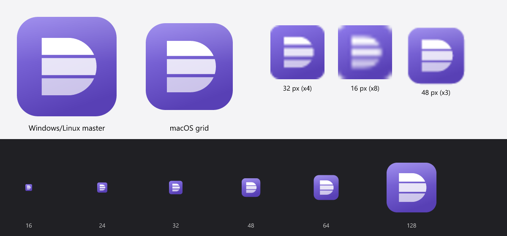

# Plan: Windows distribution — CI builds, releases, installer, signing, winget, auto-update, icon

- **Slug:** `windows-distribution`
- **Status:** in-progress
- **Spec:** [docs/spec/features/distribution.md](../../spec/features/distribution.md) · [50-build-and-release.md](../../spec/50-build-and-release.md) · ADR [0006](../adr/0006-windows-installer-and-updates.md)
- **Milestone:** M10 Distribution (post-v1)
- **Requirement IDs:** REL-010…015, REL-020…027, REL-030…032, REL-040…042, REL-050…051, REL-060, UPD-001…012, SET-090, KBD-076 (new) · NFR-023, spec 50 *CI* / *Packaging* / *Updates* (changed)
- **Created:** 2026-10-02

## 1. Goal

A Windows user can download a signed, branded installer from the GitHub home page, or run
`winget install dockering`, and from then on Dockering keeps itself up to date: it finds the new
version on GitHub Releases, downloads it in the background, and offers *Restart to update*.
Releasing is one PR plus one tag. The README shows build status, download links, and a proper
product description. A new app icon is used on every surface, on every OS.

## 2. Scope

**In:**
- GitHub Actions: CI builds and smoke-tests the Windows installer; the release workflow builds, signs, attests, and drafts a release; a winget workflow.
- The release flow standard: versioning, branches, tags, changelog, draft → publish, hotfixes, pre-releases.
- README home page: badges, download links, copy, and screenshot. Repo About and social preview.
- Inno Setup installer (x64 + arm64), portable zip, and exe resources.
- Code-signing options and setup steps.
- winget manifest and automation.
- In-app updater: full install on Windows, notify-only on macOS/Linux.
- New app icon, its generator, and its use on all platforms.

**Out:** delta updates · a Preview/nightly update channel · in-app install on macOS/Linux · MSIX/Microsoft Store · Homebrew cask, Flathub, AUR (spec 50 lists them as post-v1) · telemetry of any kind.

## 3. Assumptions & open questions

| # | Assumption / question | Default if unanswered |
|---|---|---|
| 1 | The repo stays **private** for now (user decision 2026-10-02). | Build everything; gate public-only parts behind repo variables (`PUBLIC_RELEASES`, `WINGET_ENABLED`, `WINDOWS_SIGNING`). Private-phase releases are unsigned pre-releases for testers, with the updater compiled out. |
| 2 | Auto-update is opt-out, with in-app install (user decision). | UPD-005 gates: Cargo feature, setting, env var, and policy. |
| 3 | Installer is Inno Setup, Zed-style (user decision). | ADR-0006. |
| 4 | Signing provider: choose from research (user decision). | **SignPath Foundation** (free OSS; needs a public repo, so applying waits for REL-060). **Fallback:** Certum Open Source cloud cert (€49/yr). Azure Artifact Signing only if you set up an eligible organisation (EU individuals aren't eligible). See §A2. |
| 5 | winget id `PavelPurma.Dockering`. Alternatives: `Dockering.Dockering`. | Ask before the first submission (REL-040 ⚠). |
| 6 | Icon concept **A "Stacked D"** (below). Three alternatives were rendered. | Proceed with A unless you pick another. |
| 7 | "Delta" = Zed Industries' GPUI app (delta.dev). It ships per-arch EXE installers like Zed; its internals aren't public. | We take the UX cues from Zed, whose source we could read. |
| 8 | The `.msi` is dropped on Windows. | Enterprises use `Setup.exe /ALLUSERS /VERYSILENT` or winget. |
| 9 | ISCC (Inno 6.3+) is available on `windows-2025` and `windows-11-arm` runners. | ⚠ verify (task 2). If missing: `choco install innosetup --version 6.x` (pinned). |
| 10 | Release automation uses **release-plz** (user decision 2026-10-02) instead of an xtask command. | Config in §A1. release-plz only opens the PR and creates the tag; the signed draft release stays in `release.yml`. |
| 11 | release-plz handles `version.workspace = true` by bumping `[workspace.package] version` when only `dockering` is released. | ⚠ verify in task 7a (dry run). Fallback: a `version_group` over all crates. |
| 12 | A GitHub App ("dockering-release-bot") supplies the token. The default `GITHUB_TOKEN` can't start CI on the release PR or `release.yml` on the tag. | This also works while the repo is private. A fine-grained PAT is the fallback, but it's tied to a person and expires. |
| 13 | Squash merges, so the PR title is the commit release-plz reads. | A PR-title check enforces the conventional-commit format and the scopes from CLAUDE.md. |

### Icon proposal



**A "Stacked D"** (recommended):
- A **D** cut into three stacked slabs, which reads as containers and image layers.
- Violet gradient matching the app accent `#6E56CF` (SHL-009). The current blue placeholder
  predates the accent change.
- Three masters: [`icon.svg`](windows-distribution/icon.svg) for Windows/Linux,
  [`icon-macos.svg`](windows-distribution/icon-macos.svg) on the Apple grid, and
  [`icon-small.svg`](windows-distribution/icon-small.svg), a solid D for 16–24 px where the slab
  gaps would blur.

Other concepts considered ([sheet](windows-distribution/icon-concepts.png)):
- B, a container front with a D on its door: too busy at 16 px.
- C, today's D with an arrow, re-coloured: the arrow reads as "refresh".
- D, an isometric cube: generic, and the D is lost below 32 px.

Social preview: [`social-preview.png`](windows-distribution/social-preview.png).

## 4. Requirements (as written into the spec)

Full text: [features/distribution.md](../../spec/features/distribution.md).

| ID | Requirement (short) | New/Changed |
|---|---|---|
| REL-010 | Release flow with release-plz: an always-open release PR → merge → bot tag → draft release → smoke test → publish; pre-releases; hotfix branches; manual tag fallback | New |
| REL-011 | release-plz computes the version and changelog from conventional commits (git-only, only `dockering` released); CI checks tag = version and that the changelog section exists | New |
| REL-012 | Stable, version-less asset names; `releases/latest/download/<name>` links; `SHA256SUMS` | New |
| REL-013 | Build-provenance attestations, SHA-pinned actions, protected `release` env, tag ruleset, immutable releases | New |
| REL-014 | CI builds the Windows installer and smoke-tests silent install/uninstall | New |
| REL-015 | README home page: badges, download, copy, privacy section; repo About + social preview | New |
| REL-020…027 | Inno installer, scope, wizard, shell integration, AppMutex, silent mode, portable zip, exe icon + VERSIONINFO | New |
| REL-030…032 | Authenticode for all stable Windows executables; pluggable provider; verification | New |
| REL-040…042 | winget package; manual first submission, then automated; self-update keeps winget consistent | New |
| REL-050…051 | "Stacked D" icon; generator; used everywhere | New |
| REL-060 | Public launch gate | New |
| UPD-001…012 | Updater: GitHub source, signed manifest, verification, schedule, opt-out, install kinds, apply, UI, settings, privacy, threading, files | New |
| SET-090 | Settings → Updates section | New |
| KBD-076 | Update commands in the command palette, plus the macOS app menu | New |
| NFR-023 | "No network except engines/registries" + the updater exception (UPD-010) | Changed |
| spec 50 | *CI*, *Packaging*, *Updates*, signing secrets, and tooling tables updated | Changed |

## 5. Engine contract impact

None. The updater is not engine I/O and doesn't touch `Engine`, the DTOs, or `Capabilities`.
It is a hub *service* like `StatsService`:

```rust
// dk-update (new crate; no GPUI; tokio + reqwest only, feature-gated in dk-hub)
pub struct UpdateManifest { pub schema: u32, pub version: semver::Version, pub pub_date: String,
                            pub notes_url: String, pub platforms: BTreeMap<String, PlatformAsset> }
pub struct PlatformAsset { pub kind: AssetKind, pub url: String, pub sha256: String, pub size: u64 }
pub enum InstallKind { InnoUser, InnoMachine, Portable, Other }          // UPD-006
pub enum UpdateStatus { Disabled { by_policy: bool }, Idle { last_check: Option<OffsetDateTime> },
                        Checking, Available { version, notes_url, notify_only: bool },
                        Downloading { version, done: u64, total: u64 }, Ready { version, notes_url },
                        Error { message: String, manual: bool } }
pub enum UpdateCheck { UpToDate, Available(Version), Disabled }

// dk-hub HubHandle additions (spec 10 §3.3)
pub fn update_status(&self) -> HubStream<UpdateStatus>;   // replays current status first
pub fn check_for_updates(&self) -> HubCall<UpdateCheck>;   // manual; Errors surface
pub fn apply_update(&self) -> HubCall<()>;                // spawns installer (argv), then UI quits
```

| Op | Docker | WSL distro | WSLC COM | WSLC CLI | Capability |
|---|---|---|---|---|---|
| — | n/a | n/a | n/a | n/a | n/a |

## 6. Design

### 6.1 Data flow & threading

- **Hub.** `dk-hub` starts an `UpdateService` on the hub runtime when the `updater` feature is on
  and UPD-005 doesn't disable it.
  - It owns a `watch` channel of `UpdateStatus` and a timer (30 s, then 24 h ± 1 h).
  - Network work uses `reqwest` with rustls and the platform verifier, honouring proxy env vars.
  - Downloads stream to `<data-local>/updates/<ver>/<name>.part`, are hashed while streaming, then
    renamed. Progress is throttled to ≥ 250 ms or ≥ 1 %.
- **Verification order** (UPD-003):
  1. manifest `.minisig` against the embedded keys (current, next);
  2. `schema == 1`;
  3. `version > CARGO_PKG_VERSION`;
  4. the `platforms` key for this OS and arch;
  5. after download: size and SHA-256;
  6. on Windows: `WinVerifyTrust` plus the subject matching the running exe (skipped when the
     running exe is unsigned, i.e. private-phase builds).
- **Install kind** (UPD-006): from `current_exe()` at hub start.
  - Inside `%LocalAppData%\Programs\Dockering` and an `unins000.exe` sibling exists → `InnoUser`.
  - Inside `%ProgramFiles%` → `InnoMachine`.
  - Otherwise → `Portable`.
- **Apply.**
  - `apply_update` spawns `Command::new(setup).args([...])` detached, with
    `CREATE_NEW_PROCESS_GROUP` and no shell (NFR-022), then returns.
  - The UI then calls `cx.quit()` after state is saved.
  - For `InnoMachine`, the argv adds `/ALLUSERS` and the installer asks for UAC. If the user
    declines, Dockering has already quit, so the installer's `[Run]` step relaunches the old
    version: the `[Code]` exit hook checks `/RELAUNCH` on every exit path. The relaunch uses
    `runasoriginaluser` so the app never runs elevated.
- **UI.**
  - An `UpdateStore` entity (a GPUI global) subscribes to `update_status()`. It stores
    `_status_task` and `check_task` (NFR-004) and tags each manual check with a request id to drop
    stale results (NFR-005).
  - The status-bar item and Settings section observe the store.
  - Nothing blocks the UI thread: every file and process operation is on the hub (NFR-001; the CI
    grep covers it).

### 6.2 UI

- **Status bar** (right-aligned, after the existing items):
  - GPUI Kit `Button` in ghost style with a `Spinner` while downloading;
  - an accent `Button` "Restart to update (X.Y.Z)" when ready;
  - a link-style `Button` "Dockering X.Y.Z available" for notify-only.
  - It sits in the status-bar focus region (F6). A visible focus ring is required. Its tooltip names
    the palette command.
- **Notification** when the update is ready, once per version (`notified_version`):
  "Dockering X.Y.Z is ready to install" with actions *Restart now* and *Release notes*
  (KBD-074 reachable).
- **After an update** (`last_run_version` < current): an info notification "Updated to X.Y.Z" with
  *What's new*.
- **Settings → Updates** (SET-090): `GroupBox` with a `Switch` (*Check for updates automatically*),
  a version `DescriptionList` row, *Last checked* with the result, a *Check now* `Button` with an
  inline `Spinner` and result text, and a *View release notes* link. Policy-disabled → a
  `Alert`-style note and disabled controls.
- **Palette** (KBD-076): `CheckForUpdates`, `RestartToUpdate` (enabled only when `Ready`), and
  `ViewReleaseNotes`. No default chords.
- **macOS:** *Dockering → Check for Updates…* (SHL-020).
- **Four states** on the Settings section: loading (spinner on *Check now*), empty (never checked),
  error (inline, with a *Retry* that runs *Check now*), data.

### 6.3 Errors

- No engine errors.
- Updater errors are a `thiserror` enum in `dk-update`: `Network`, `Http(status)`,
  `Signature`, `Integrity`, `UntrustedInstaller`, `Io`, `Spawn`.
- Automatic checks only log them (NFR-050, no secrets).
- Manual checks show them inline in Settings, or as an error notification with *Copy details*.
- `Signature`, `Integrity`, and `UntrustedInstaller` delete the download and are logged at
  `warn`. They are never retried for the same version until the next manifest change.

### 6.4 GitHub Actions layout

| Workflow | Trigger | Jobs (Windows-relevant) |
|---|---|---|
| `ci.yml` (changed) | push `main`, PR | existing lint/test/build. **New** `installer` job on `windows-2025`: matrix x64 and arm64 (arm64 cross-built on x64 runners, or `windows-11-arm`); `cargo build --release`; `cargo xtask package --formats inno,zip`; upload the artifacts (14 days). **New** `installer-smoke` (x64): silent install per user and all-users → `--version` → uninstall → assert clean (REL-014). The `build` job drops `wix`/`nsis` on Windows. |
| `release.yml` (changed) | tag `v*` | `verify` (tag = version, changelog section, tag on `main` history or `release/*`) → `package` matrix (6 targets; Windows: build → **sign binaries** → Inno → **sign setup** → verify signatures → zip) → `manifest` (`cargo xtask update-manifest` → `dockering-update.json` → minisign → `SHA256SUMS`) → `attest` (provenance for every asset) → `publish` (draft release, `prerelease` if the tag has `-`; stable + unsigned → fail) |
| `release-plz.yml` (new) | push to `main`, `release/*` | `release-pr` job: App token (`actions/create-github-app-token`) → `release-plz/action` `command: release-pr` (opens or updates `chore(release): vX.Y.Z`; CI runs on it because of the App token). `release` job: `command: release` (with `release_always = false`, it acts only when a release PR was just merged) → tag `vX.Y.Z` → starts `release.yml`. `contents: write`, `pull-requests: write`; PR job concurrency per ref, no cancelling. |
| `pr-title.yml` (new) | `pull_request` (opened, edited, synchronize) | `amannn/action-semantic-pull-request@<sha>`: conventional-commit type + allowed scopes (CLAUDE.md) |
| `winget.yml` (new) | `release: published`, `workflow_dispatch` | skip pre-releases; `if: vars.WINGET_ENABLED == 'true'`; `vedantmgoyal9/winget-releaser@<sha>` with `identifier: PavelPurma.Dockering`, `installers-regex: 'Dockering-Setup-(x64|arm64)\.exe$'`, `token: ${{ secrets.WINGET_TOKEN }}` |
| `icons` check (in `ci.yml` lint) | PR | `cargo xtask icons --check` (REL-050) |

**Badges** (REL-015). Work now:
- `https://github.com/pavel-purma/dockering/actions/workflows/ci.yml/badge.svg?branch=main`
- `…/release.yml/badge.svg`

Viewers must be signed in with access while the repo is private.

After the public launch, add shields.io badges:
- `img.shields.io/github/v/release/pavel-purma/dockering`
- `…/github/downloads/pavel-purma/dockering/total`
- `…/github/license/pavel-purma/dockering`
- `…/winget/v/PavelPurma.Dockering`

## 7. Tasks

| # | Task | Owner agent | IDs | Verify |
|---|---|---|---|---|
| 1 | **Icon pipeline.** Move the masters to `assets/app-icon/src/`. Add `cargo xtask icons [--check]` (`resvg` + `ico` + `icns` crates in xtask only), generating every size, `.ico`, `.icns`, the Inno wizard BMPs, and `assets/brand/*`. Regenerate the checked-in icons and add the CI staleness check. | release-engineer | REL-050 | `cargo xtask icons --check` green; visual check of 16/24/32/48/256 in Explorer |
| 2 | **Spike S-9: Inno on the runners.** Is ISCC present on `windows-2025` / `windows-11-arm`? Does an Inno arm64 build work (`ArchitecturesAllowed=arm64`)? Test `AppMutex` + `CloseApplications` against a running GPUI window, and `/UPDATE /RELAUNCH` + `runasoriginaluser`. Write the findings into the plan. | windows-platform | REL-020, 024, 025, UPD-007 | Spike notes in §9; a throw-away `.iss` installs, upgrades, and relaunches on a runner |
| 3 | **Exe resources.** Add a `build.rs` in `crates/dockering` (`winresource`, or `embed-resource` already in the lock file) with icon ID 1 and `VERSIONINFO` from `CARGO_PKG_VERSION`. Check it doesn't clash with gpui's manifest resource. Set the Windows AUMID `dev.dockering.Dockering` at startup via GPUI's platform `set_app_identity` (⚠ verify it's reachable from gpui-kit; the app sets only the Linux `app_id` today), and hold the `dev.dockering.Dockering` named mutex (REL-024; in `dk-hub::single_instance`, Windows cfg). | windows-platform | REL-027, REL-023, REL-024 | Explorer shows the icon and version; taskbar icon correct; `xtask check-blocking` green |
| 4 | **Inno script.** `packaging/windows/dockering.iss`: fixed AppId GUID, per-user default with an `/ALLUSERS` override, modern wizard + branded BMPs, Start Menu (AUMID), optional desktop icon, licence files, AppMutex/CloseApplications, uninstall prompt to keep data, `[Code]` for `/UPDATE` (no wizard pages, progress only) and `/RELAUNCH` (`runasoriginaluser`), `SignTool=` hook for the uninstaller. | windows-platform | REL-020…025, UPD-007 | Manual install/upgrade/repair/uninstall on Win 11 x64 + arm64; silent switches exit 0 |
| 5 | **xtask packaging.** New `inno` format (calls `ISCC.exe` with `/DVersion=… /DArch=… /DSourceDir=…` and an optional `/S` sign tool), portable zip naming, REL-012 stable names for every OS (rename after cargo-packager), and `SHA256SUMS`. Remove `wix`/`nsis` from the Windows defaults. Update `packager.toml` comments. | release-engineer | REL-012, REL-020, REL-026 | `cargo xtask dist` on Windows produces `Dockering-Setup-x64.exe` + `Dockering-x64.zip` |
| 6 | **CI installer + smoke jobs** in `ci.yml` (§6.4). Silent install/uninstall assertions in PowerShell. | release-engineer | REL-014 | Workflow green on a PR; artifact downloadable |
| 7a | **release-plz.**
• Add `release-plz.toml` (§A1) and the `release-plz.yml` + `pr-title.yml` workflows.
• Create the GitHub App `dockering-release-bot` (Contents + Pull requests read/write; installed on the repo only). Store the secrets `RELEASE_BOT_APP_ID` and `RELEASE_BOT_PRIVATE_KEY` in the `release-plz` environment.
• Set up the tag ruleset (create `v*`: App + maintainer bypass) and switch the repo to squash merges only.
• Convert the hand-written `[Unreleased]` section in `CHANGELOG.md` into release-plz's format.
• Verify ⚠ items 11 and 12 and the `set-version` pre-release path. | release-engineer | REL-010, 011, 013 | `release-plz update --dry-run` shows the expected bump and changelog. On the repo: a `feat:` PR → release PR `v0.2.0` opens and CI runs on it → merge → tag `v0.2.0` starts `release.yml` (use a `-alpha` version for the first run). |
| 7 | **Release workflow.** `release.yml` restructure: `verify` job, two-stage pluggable signing (`WINDOWS_SIGNING` = `signpath` / `azure` / `none`), signature verification, `attest-build-provenance`, actions pinned to SHAs, stable-unsigned guard. Document the flow in `CONTRIBUTING.md` / `docs/release.md`. | release-engineer | REL-010, 011, 013, 030…032 | Dry run: tag `v0.1.0-alpha.1` on a fork, or with `workflow_dispatch` → draft pre-release with all assets + attestations |
| 8 | **Update manifest in CI.** `cargo xtask update-manifest --assets dist/ --version X --notes-url …` → JSON (UPD-002); sign with `minisign -S` (the `rsign2` crate in xtask, or the minisign binary) using `UPDATE_SIGNING_KEY`. Generate the key pair (current + next) and store the public keys in `crates/dk-update/keys/`. | release-engineer | UPD-002, UPD-003 | Unit test: manifest round-trip; `minisign -V` passes in CI |
| 9 | **`dk-update` crate.** Manifest parsing (unknown fields ignored, schema check), minisign verification, SemVer compare, platform key, install-kind detection, download with hashing and resume-less retry, cleanup, `WinVerifyTrust` + subject check (`cfg(windows)`, documented `unsafe`). No GPUI. Add to deny/about. | rust-core (+ windows-platform for WinVerifyTrust) | UPD-001…003, 006, 010, 012 | Unit + proptest on the manifest; tests with a local `hyper` test server: tampered manifest/hash/signature rejected; `cargo deny` green |
| 10 | **Hub `UpdateService`** behind the `dk-hub/updater` feature: timer + jitter, `watch` status, the `update_status`/`check_for_updates`/`apply_update` HubHandle API, UPD-005 gates (env, policy registry, config, demo), state in `state.json`, `[updates] check` in `config.toml` (schema stays version 1 with a default). | rust-core | UPD-004, 005, 007, 011, 012 | Hub tests with a fake clock + fake source: schedule, disable-by-policy = zero requests, stale-check guard |
| 11 | **Updater UI.** `UpdateStore` global, the status-bar item, notifications, the Settings → Updates section, palette actions + the macOS menu item, strings in `strings.rs`, and the `updater` feature passthrough in `crates/dockering`. | gpui-ui | UPD-008, 009, SET-090, KBD-076 | View tests for every `UpdateStatus` render; KBD-093 action coverage; KBD-092 Tab walk includes the new section; screenshots |
| 12 | **Release workflow wiring for the updater.** Build with `--features updater` when `vars.PUBLIC_RELEASES == 'true'`. Upload `dockering-update.json(.minisig)`. | release-engineer | UPD-005, REL-012 | A private-phase release has no update traffic (check with `--version` + a log line "updates: compiled out") |
| 13 | **winget.** `packaging/winget/` template manifests (schema 1.12), `winget.yml` (§6.4), and the first-submission runbook (§A3). | release-engineer | REL-040…042 | `winget validate` on the generated manifests; local `winget install --manifest` works; after launch: the first PR merged |
| 14 | **README + repo home page.** New README (§A4) with the icon, badges, download table, install, privacy, and build sections moved below. `docs/release.md` holds the flow. `assets/brand/` holds the logo and social preview. Set the repo description/topics (`gh repo edit`) at launch. Add the CHANGELOG entry. | release-engineer | REL-015 | Renders on GitHub; all links resolve against a real draft release |
| 15 | **Platform icon use.** Point `packager.toml` icons at the generated set (macOS `.icns` from `icon-macos.svg`, Linux hicolor PNGs). Check the `.desktop` file, the `.dmg` background, and the window icon on Linux (Wayland uses the `app_id` + desktop file). | release-engineer | REL-051 | Screenshots on macOS dock and GNOME/KDE taskbar |
| 16 | **Signing enrolment** (maintainer + release-engineer, after REL-060): apply to SignPath Foundation (§A2). Configure the SignPath project, artifact configuration, and signing policy. Add the secrets and set `WINDOWS_SIGNING=signpath`. Add the code-signing policy page to the README. | release-engineer | REL-030…032, REL-060 | A signed release passes `signtool verify /pa`; SmartScreen shows the publisher |
| 17 | **Tests + checklist.** ID→test table, plus release-checklist sections: "Installer" (fresh install user/machine, upgrade from N-1, uninstall keep/remove data, arm64) and "Updater" (N-1 → N via *Restart to update*, notify-only zip, policy-disabled, offline). | qa-engineer | all | Checklist PR; §8 table filled with real test names |
| 18 | Review | reviewer | all | verdict: approve (layering: `dk-update` has no GPUI; UI never names tokio; NFR-001 grep; NFR-022 argv; NFR-020 no secrets in logs) |

**Order:** 1 → 2 (spike) → 3, 4, 5 → 6 → 7a → 7 → 8 → 9 → 10 → 11 → 12 → 13, 14, 15 → 16 (needs the public repo) → 17 → 18.
A private-phase pre-release (`v0.1.0-alpha.1`, unsigned, updater compiled out) can ship after tasks 7a + 7.

**Size:** ≈ 13–15 dev-days, plus SignPath onboarding lead time (days to weeks, external).

## 8. Test plan

| ID | Layer | Test name(s) |
|---|---|---|
| REL-010, 011 | CI + dry run | `release-plz update --dry-run` on a fixture branch (expected bump for `feat`/`fix`/breaking); `release.yml` `verify` job (tag = version, changelog section present); the first real release run (task 7a) |
| REL-012 | xtask unit | `rel_012_stable_asset_names_per_target` |
| REL-014, 020…026 | CI job | `installer-smoke` (user + machine), plus the manual checklist (upgrade, repair, arm64) |
| REL-027 | CI step | PowerShell `(Get-Item dockering.exe).VersionInfo` = version; icon resource 1 present |
| REL-030…032 | CI step | `signtool verify /pa /all` + subject check (stable releases) |
| REL-040…042 | CI / manual | `winget validate`; checklist "winget upgrade after self-update shows X.Y.Z" |
| REL-050 | CI | `cargo xtask icons --check` |
| UPD-001…003 | unit (dk-update) | `upd_002_manifest_roundtrip_ignores_unknown`, `upd_002_unknown_schema_is_no_update`, `upd_003_rejects_bad_signature`, `upd_003_rejects_hash_mismatch`, `upd_003_rejects_size_mismatch`, `upd_003_accepts_next_key`, `upd_004_no_downgrade_or_prerelease` |
| UPD-003 (Windows) | unit `cfg(windows)` | `upd_003_untrusted_installer_rejected` (unsigned test exe vs signed fixture subject) |
| UPD-004, 005 | hub test (fake clock/source) | `upd_004_first_check_after_30s_then_daily`, `upd_005_disabled_makes_no_requests` (env, policy, setting, demo) |
| UPD-006 | unit | `upd_006_install_kind_from_path` |
| UPD-007 | manual + spike S-9 | checklist "Restart to update" N-1 → N, user and machine |
| UPD-008, 009, SET-090 | GPUI view tests | `upd_008_status_bar_renders_each_state`, `upd_008_ready_notification_once_per_version`, `set_090_updates_section_states`, `set_090_policy_disables_controls` |
| UPD-011 | hub test | `upd_011_stale_manual_check_dropped` |
| KBD-076 | view test | `kbd_076_update_actions_in_palette` (+ KBD-093 coverage) |

## 9. Risks & spikes

| Risk | Mitigation / spike |
|---|---|
| release-plz with an unpublished workspace (git-only, `version.workspace`, one released package) behaves differently than expected | Task 7a dry run first. Fallbacks: a `version_group` over all crates, or the manual tag path (REL-010), which needs no release-plz |
| Commit messages are too noisy or terse for user-facing notes | Squash merges + PR-title check. The maintainer edits the changelog in the release PR before merging. `commit_parsers` skip `docs`/`test`/`chore`/`ci`. |
| The release-bot App key leaks | Minimal permissions (Contents/PRs), key only in the `release-plz` environment. Signing keys stay in a separate `release` environment with required reviewers, so a leaked bot key can create tags but not signed releases. |
| ISCC missing on the runners, or Inno arm64 quirks | Spike S-9 (task 2); pin the choco version |
| SignPath declines or is slow | Fallback to Certum OSS (§A2). Meanwhile, only pre-releases ship. The REL-031 `none` guard blocks unsigned stable releases. |
| An unsigned private-phase build trips Defender/SmartScreen for testers | Expected. Testers use *More info → Run anyway*; documented in the pre-release notes |
| Updater key loss or compromise | Two embedded public keys (current + next). The key lives only in the `release` environment, with required reviewers. Rotation runbook in `docs/release.md`. |
| Malicious release asset (compromised token) | Signed manifest + SHA-256 + Authenticode subject pinning + immutable releases + attestations (REL-013, UPD-003) |
| Silent update while the app is busy (terminal sessions, pulls) | Never automatic: only *Restart to update*. The confirmation lists active terminals and pulls (same rule as quit). |
| The all-users UAC prompt is declined after the app has quit | The installer relaunches the old version (`/RELAUNCH` on every exit path); S-9 verifies this |
| winget validation flags (new publisher, unsigned) | Submit only signed releases. The first submission is manual and watched. |
| GitHub `releases/latest/download` redirect behaviour or rate limits | The anonymous asset CDN has no API rate limit. The client follows ≤ 5 redirects, to `github.com` and `*.githubusercontent.com` only. |
| Private repo: release assets need auth | The updater is compiled out until `PUBLIC_RELEASES` (UPD-005); README download links work only for collaborators until then |

### Spike S-9 results (2026-10-03)

| Question | Result |
|---|---|
| Is Inno Setup on the GitHub runners? | Yes. `windows-2025` ships 6.7.1 ([inventory](https://github.com/actions/runner-images/blob/main/images/windows/Windows2025-Readme.md)); `windows-11-arm` ships 6.6.1 ([inventory](https://github.com/actions/partner-runner-images/blob/main/images/arm-windows-11-image.md)). Both are ≥ 6.3 (arm64 support). The workflows fall back to `choco install innosetup --version 6.7.1` only if it's missing. |
| Silent per-user install, reinstall, and uninstall | Pass, locally on Win 11 x64 with Inno 6.7.3 (`scripts/installer-smoke.ps1`). The uninstall removes the install dir, the HKCU uninstall key, and the Start Menu shortcut. |
| `/UPDATE /RELAUNCH` with the app running | Pass. Steps: install 0.1.0 and start it; start the 0.2.0 setup with the updater's exact argv. `AppMutex` + `CloseApplications=force` closed the running app, the same *Installed apps* entry moved to 0.2.0, and Dockering relaunched (`runasoriginaluser`). |
| `/ALLUSERS` | Not run locally (it needs a UAC click). CI's `installer-smoke` runs it on the elevated runner. |
| UAC declined during an all-users update | Not handled. When elevation is declined, the setup exits before `[Run]`, so nothing relaunches the old version and the user has to start Dockering again. Follow-up: the UI could wait until the installer process is elevated before quitting. |
| Exe resources | `embed-resource` 3.0.11 with icon ID 1 + `VERSIONINFO` doesn't clash with GPUI's manifest resource. Explorer shows the icon, and `VersionInfo` reports `Dockering 0.1.0`. |
| AUMID | GPUI exposes `App::set_app_identity`, so no `unsafe` code is needed in the app crate. |

| release-plz on this workspace | Dry run with release-plz 0.3.169 in a throwaway worktree. With a `version_group` over all crates, a `feat(update)` in `dk-update` plus a `fix(ui)` in `dockering` gives 0.1.0 → 0.2.0 for every crate and one `CHANGELOG.md` section with *Added* and *Fixed*. Without the group, the `feat` in a library crate was ignored (0.1.1). |

## 10. Revision log

- 2026-10-03: implemented (tasks 1–15, 17–18; task 16 SignPath enrolment waits for the public launch). Spike S-9 recorded above. Deviations reconciled into the spec: release-plz `version_group`; Updates section placed before Diagnostics; macOS menu item *Check for Updates…*.
- 2026-10-02: revised. The release flow uses **release-plz** (user decision): REL-010/011 rewritten, the xtask `release prepare` command dropped, task 7a added (App token, tag ruleset, PR-title check), §6.4 and §A1 updated.
- 2026-10-02: created (research on Zed, Delta, Velopack, winget, and signing options. User decisions: opt-out updates with in-app install, Inno Setup, signing chosen from research, repo stays private for now).

---

## Appendix

### A1. Release flow (standard)

```
feature PRs (squash, conventional-commit titles) ──▶ main
      │ every push to main
      ▼
release-plz.yml / release-pr ──▶ opens/updates ONE PR "chore(release): v0.2.0"
      │                          (workspace version, Cargo.lock, CHANGELOG.md section)
      │ maintainer: review, polish the changelog, run the release checklist, merge
      ▼
release-plz.yml / release ──▶ creates tag v0.2.0 (GitHub App token → starts other workflows)
      ▼
release.yml: verify → package×6 (sign) → manifest (minisign) → attest → DRAFT release
      │ maintainer downloads Setup-x64.exe from the draft, installs, sanity check
      ▼
Publish ──▶ "latest" moves ──▶ updater sees it (≤ 24 h) ──▶ winget.yml opens a winget-pkgs PR
```

**What you do per release:** merge one PR and click *Publish*. You never type a version number or a tag.

**`release-plz.toml`** (draft; field names from the release-plz config reference, checked 2026-10-02; `[changelog]` keys ⚠ verify):

```toml
[workspace]
git_only = true                         # versions come from v* tags; nothing is on crates.io
publish = false
release = false                         # every crate opts out…
git_tag_name = "v{{ version }}"
git_release_enable = false              # release.yml creates the draft with signed assets
release_always = false                  # tag only when a release PR is merged
semver_check = false                    # an application, no public library API
features_always_increment_minor = true  # feat: → 0.(x+1).0 while in 0.x
pr_labels = ["release"]

[[package]]
name = "dockering"                      # …except the app, which carries the workspace version
release = true
changelog_path = "CHANGELOG.md"
changelog_include = ["dk-core", "dk-hub", "dk-engine-docker", "dk-engine-wslc", "dk-wsl", "dk-terminal"]

[changelog]                             # git-cliff: Keep a Changelog groups, skip noise
commit_parsers = [
  { message = "^feat", group = "Added" },
  { message = "^fix", group = "Fixed" },
  { message = "^(perf|refactor)", group = "Changed" },
  { message = "^(docs|test|chore|ci|style|build)", skip = true },
]
```

**`release-plz.yml`** (shape; pin actions to SHAs in the real file):

```yaml
on: { push: { branches: [main, "release/*"] } }
permissions: { contents: write, pull-requests: write }
jobs:
  release-pr:
    runs-on: ubuntu-24.04
    environment: release-plz
    concurrency: { group: release-plz-${{ github.ref }}, cancel-in-progress: false }
    steps:
      - id: app
        uses: actions/create-github-app-token@v2
        with: { app-id: "${{ secrets.RELEASE_BOT_APP_ID }}", private-key: "${{ secrets.RELEASE_BOT_PRIVATE_KEY }}" }
      - uses: actions/checkout@v7
        with: { fetch-depth: 0, persist-credentials: false, token: "${{ steps.app.outputs.token }}" }
      - uses: dtolnay/rust-toolchain@master
        with: { toolchain: "1.98" }
      - uses: release-plz/action@<sha>
        with: { command: release-pr }
        env: { GITHUB_TOKEN: "${{ steps.app.outputs.token }}" }
  release:                                # same steps, command: release (no concurrency group)
```

- **Versioning:** SemVer. `0.x` until the first public stable release. `1.0.0` = v1 public.
- **Branches and tags:** `main` is protected (PR + CI required, squash merges only, PR-title check). Tags `vX.Y.Z` and
  `vX.Y.Z-rc.N` are created by the release bot when a release PR merges. The maintainer can still tag by hand
  (ruleset bypass) as a fallback. `release/X.Y` exists only for hotfixes when `main` can't be released;
  release-plz runs there too.
- **Notes:** `CHANGELOG.md` (Keep a Changelog, generated by release-plz, polished in the release PR) is the source. The release body = the version's
  section + "Verify: `gh attestation verify <file> -R pavel-purma/dockering`" + the
  `SHA256SUMS` link.
- **Pre-releases:** `-alpha.N` while private; `-rc.N` before every minor once public. Set the version in
  the release PR (`release-plz set-version dockering@0.2.0-rc.1` ⚠ verify, or edit `Cargo.toml` on the PR
  branch) and merge. They are never "latest", so the updater and winget ignore them.
- **Yanking a bad release:** publish a fixed patch (preferred). If it's urgent, mark the bad
  release as pre-release, which moves *latest* back, and open a winget PR to remove that version.

### A2. Windows code signing

**Why:** Unsigned executables that spawn hidden `wsl.exe` and create named pipes trigger
SmartScreen *and* Defender heuristics. winget validation (Defender plus several AV engines) is
smoother with signed installers. Signing alone doesn't remove SmartScreen warnings; reputation
builds per certificate over downloads. EV no longer gives instant reputation.

**Options for an individual in Czechia (checked 2026-10-02):**

| Option | Eligible? | Cost | CI fit | Publisher shown |
|---|---|---|---|---|
| **SignPath Foundation** (recommended) | OSS with an OSI licence, public repo, released and maintained, built in CI | Free | Native GitHub Actions integration; manual approval per release | "SignPath Foundation" |
| Certum Open Source Code Signing (SimplySign cloud) | Individuals, yes | ≈ €49/yr | Awkward: the cloud HSM needs an OTP; headless use relies on community workarounds ⚠ verify | "Open Source Developer, Pavel Purma" |
| Azure Artifact Signing | Individuals only in the US/CA. EU **organisations** are eligible (e.g. an s.r.o.) | $9.99/mo | Best: wiring already in `release.yml` | Organisation name |
| OV/EV from a CA (cloud HSM) | Yes | €200–600/yr; certificates ≤ 460 days since 2026-09-15 | Depends on the CA's HSM API | Your name |

**Steps: SignPath Foundation** (after the repo is public, REL-060):
1. Make sure everything is OSI-licensed (`cargo deny` + `about.toml` already enforce this). Add a
   **Code signing policy** section to the README: who builds, who approves, that only CI builds
   from `main` tags are signed, and a privacy note.
2. Enable MFA on GitHub. Define roles (author = maintainer, approver = maintainer; optionally a second reviewer).
3. Apply at signpath.org (project name, repo URL, release history; at least one public pre-release must exist).
4. After acceptance, in SignPath:
   - create the project `dockering` and link the GitHub repo (trusted build system: GitHub Actions);
   - add an *artifact configuration* that signs `dockering.exe` inside a zip, and one for the setup `.exe`;
   - add a signing policy `release-signing` with manual approval.
5. In GitHub:
   - secret `SIGNPATH_API_TOKEN` (environment `release`);
   - vars `SIGNPATH_ORGANIZATION_ID`, `SIGNPATH_PROJECT_SLUG=dockering`, `WINDOWS_SIGNING=signpath`.
6. `release.yml`, Windows job:
   1. upload the unsigned `dockering.exe` as an artifact;
   2. `signpath/github-action-submit-signing-request@<sha>` (wait for completion);
   3. download the signed exe;
   4. run ISCC;
   5. a second signing request for `Dockering-Setup-*.exe`;
   6. `signtool verify /pa /all`.
7. The uninstaller: Inno writes `unins000.exe` at install time. Sign it with ISCC's `SignTool`, or
   sign the uninstaller stub through SignPath with `SignedUninstaller=yes` (⚠ verify in S-9 how this
   combines with remote signing; the alternative is a pre-signed `uninst.e32` via
   `SignedUninstallerDir`).

**Steps: Azure Artifact Signing** (if you set up an eligible organisation):
1. Azure subscription → resource *Artifact Signing account* (region e.g. West Europe) → *Identity validation* (Organization, Public Trust; needs company registry documents) → *Certificate profile* (Public Trust).
2. App registration (service principal) with the role *Artifact Signing Certificate Profile Signer* on the account.
3. Secrets in environment `release`: `AZURE_TENANT_ID`, `AZURE_CLIENT_ID`, `AZURE_CLIENT_SECRET` (better: federated OIDC credentials, no secret), `AZURE_SIGNING_ENDPOINT` (e.g. `https://weu.codesigning.azure.net/`), `AZURE_SIGNING_ACCOUNT`, `AZURE_CERT_PROFILE`. Set `WINDOWS_SIGNING=azure`.
4. The existing `Azure/artifact-signing-action@v2` steps are kept, re-ordered to: exe → ISCC → setup.

**Steps: Certum OSS** (fallback): buy the *Open Source Code Signing – SimplySign* product → identity
verification (ID + proof of OSS project) → activate SimplySign on a phone → test signing locally
with `signtool` through the SimplySign Desktop virtual card. CI automation is a spike; until then,
sign release assets locally from the draft and re-upload them (a documented manual step).

### A3. winget

**First submission (manual, once, after the first signed public stable release):**
1. `winget install Komac` (or `wingetcreate`).
2. `komac new PavelPurma.Dockering --version 0.2.0 --urls https://github.com/pavel-purma/dockering/releases/download/v0.2.0/Dockering-Setup-x64.exe https://github.com/pavel-purma/dockering/releases/download/v0.2.0/Dockering-Setup-arm64.exe`
   Komac detects `inno` and both scopes. Fill in Publisher `Pavel Purma`, PackageName `Dockering`,
   License `MIT`, ShortDescription (§A4 tagline), Tags `docker, containers, wsl, devtools`,
   Moniker `dockering`, `ReleaseNotesUrl`.
3. Check the locale manifest. Make sure `UpgradeBehavior: install` and that both `Scope: user` and
   `machine` entries exist (Inno's `/CURRENTUSER` vs `/ALLUSERS`).
4. `winget validate <dir>`, then `winget install --manifest <dir>` locally (Windows Sandbox).
5. `komac submit`. This opens a PR in `microsoft/winget-pkgs`. Watch the validation bot and answer
   the moderators.

**Automation (every later stable release):**
1. Fork `microsoft/winget-pkgs` to `pavel-purma`.
2. Create a **classic PAT** with `public_repo` (+ `workflow`) and store it as the secret `WINGET_TOKEN`.
3. Set `WINGET_ENABLED=true`.
4. `winget.yml` runs on `release: published`.

### A4. Home page copy

**Repo About (description):** "Fast, native desktop client for Docker, Docker in WSL, and WSL
containers. Rust + GPUI. Windows · macOS · Linux."
**Topics:** `docker`, `containers`, `wsl`, `wslc`, `desktop-app`, `rust`, `gpui`, `docker-desktop-alternative`, `devtools`.

**README top** (draft):

```markdown
<p align="center"></p>
<h1 align="center">Dockering</h1>
<p align="center"><b>A fast, native desktop client for container engines.</b><br>
Docker · Docker inside WSL distros · WSL containers (WSLC) — one lightweight window, on Windows, macOS, and Linux.</p>
<p align="center">
  <a href="https://github.com/pavel-purma/dockering/actions/workflows/ci.yml"></a>
  <a href="https://github.com/pavel-purma/dockering/actions/workflows/release.yml"></a>
  <!-- after public launch: latest release · downloads · license · winget -->
</p>
<p align="center"></p>

## Download

| Windows | macOS | Linux |
|---|---|---|
| [Installer x64](https://github.com/pavel-purma/dockering/releases/latest/download/Dockering-Setup-x64.exe) · [ARM64](…/Dockering-Setup-arm64.exe) | [Apple silicon](…/Dockering-aarch64.dmg) · [Intel](…/Dockering-x86_64.dmg) | [AppImage](…/Dockering-x86_64.AppImage) · [.deb](…/Dockering-x86_64.deb) · [tar.gz](…/Dockering-x86_64.tar.gz) (also aarch64) |
| `winget install dockering` | | |
| [Portable zip](…/Dockering-x64.zip) | | |

All releases and checksums: [Releases](https://github.com/pavel-purma/dockering/releases) · Verify with `gh attestation verify <file> -R pavel-purma/dockering`.

## Why Dockering
- **Native and fast.** Rust + GPUI, GPU-rendered at 60 fps, starts in under a second, and uses no Electron.
- **All your engines in one place.** Docker Desktop, Docker inside any WSL distro, WSL containers, and remote Docker over TLS. Switch with `Ctrl+K`.
- **Keyboard-first.** Every action has a shortcut or a command-palette entry.
- **Just the core.** Containers (grouped by Compose project), logs, terminal, live stats, images, volumes, and networks. No sign-in, no extensions, no telemetry.

## Privacy & network
Dockering talks only to the engines you configure. Release builds check GitHub Releases once a day
for updates (an anonymous HTTPS request; no ids). Turn it off in **Settings → Updates**, with
`DOCKERING_DISABLE_UPDATES=1`, or with the `DisableUpdates` policy.
```

(Then: Features · Install details · Build from source (the current README content) · Docs · License · Contributing.)

### A5. Sources (checked 2026-10-02)

- Zed:
  - installer: [zed.iss](https://github.com/zed-industries/zed/blob/main/crates/zed/resources/windows/zed.iss), [bundle-windows.ps1](https://github.com/zed-industries/zed/blob/main/script/bundle-windows.ps1), [sign.ps1](https://github.com/zed-industries/zed/blob/main/crates/zed/resources/windows/sign.ps1)
  - updater (GPL, reference only): [auto_update.rs](https://github.com/zed-industries/zed/blob/main/crates/auto_update/src/auto_update.rs), [auto_update_helper/updater.rs](https://github.com/zed-industries/zed/blob/main/crates/auto_update_helper/src/updater.rs)
  - [winget manifest](https://github.com/microsoft/winget-pkgs/tree/master/manifests/z/ZedIndustries/Zed)
- Delta: [delta.dev](https://delta.dev/), [awesome-gpui](https://github.com/zed-industries/awesome-gpui)
- Velopack (considered and rejected): [docs](https://docs.velopack.io/), [crate](https://docs.rs/velopack)
- winget:
  - [manifest docs](https://learn.microsoft.com/en-us/windows/package-manager/package/manifest), [installer schema 1.12](https://github.com/microsoft/winget-pkgs/blob/master/doc/manifest/schema/1.12.0/installer.md), [repository policies](https://learn.microsoft.com/en-us/windows/package-manager/package/repository)
  - tools: [winget-releaser](https://github.com/vedantmgoyal9/winget-releaser), [Komac](https://github.com/russellbanks/Komac)
- Signing:
  - [Azure Artifact Signing quickstart (eligibility)](https://learn.microsoft.com/en-us/azure/artifact-signing/quickstart), [SignPath Foundation terms](https://signpath.org/terms), [Certum OSS](https://shop.certum.eu/open-source-code-signing-on-simplysign.html)
  - rules: [CA/B code-signing requirements](https://cabforum.org/working-groups/code-signing/requirements/), [SmartScreen reputation](https://learn.microsoft.com/en-us/windows/apps/package-and-deploy/smartscreen-reputation)
- cargo-packager: [PackageFormat (no Inno)](https://docs.rs/cargo-packager/latest/cargo_packager/config/enum.PackageFormat.html)
